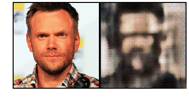

## Extreme image compression using Generative Adversarial Networks

This repository provides a learned compression algorithm for human portraits.

Use the following to clone this repository:
```bash
git clone git@github.com:mlomnitz/CompressionGAN.git
```

## Description 

This package provides an image compression algorithm using an auto-encoder in a Generative Adversarial Network (GAN) setting. First described [in](https://arxiv.org/pdf/1804.02958.pdf), the implementation in this work focuses on human faces, more specifically profile pictures.

The network was trained using a subset of 40K images curated from the [DEX project](https://data.vision.ee.ethz.ch/cvl/rrothe/imdb-wiki/) to produce faithful reconstruction of human faces with a factor of 20-30 in compression.

